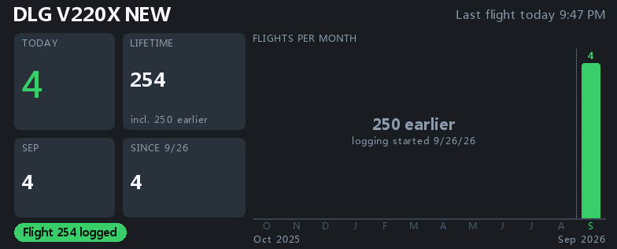
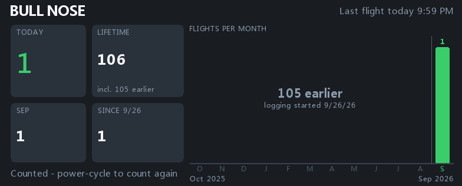
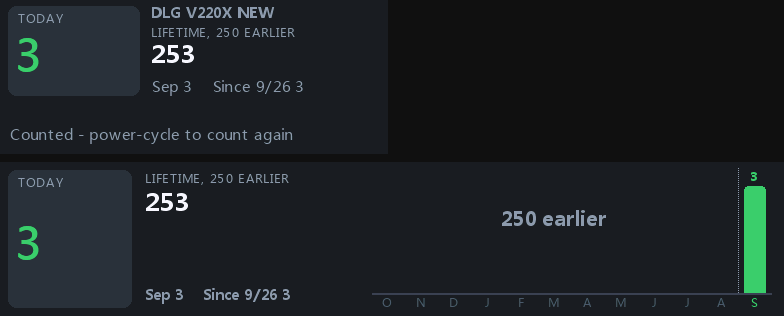
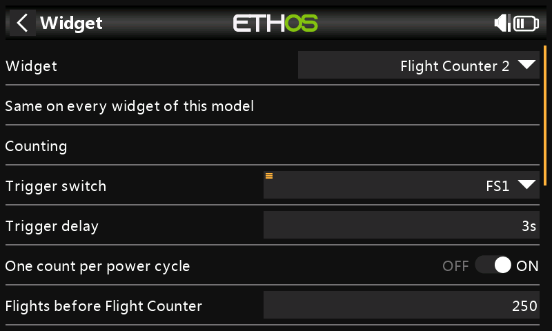

# Flight Counter 2

A FrSky Ethos widget that counts your flights. You decide what a flight is:
pick any switch, logic switch or function switch, and a flight is counted when
it turns on and stays on for the delay you set. Built for any kind of model —
jets, electrics, gas aerobatics, gliders.

Version 2 is a rewrite of Flight Counter 1.x. Every flight is recorded as its
own line, so the widget can show today, this month, this year, a 12-month
history chart and a lifetime total. Counts follow a model through a rename,
and a storage glitch can no longer zero your counts.

**Pre-release.** Tested in the FrSky Suite X20RS simulator on Ethos 1.6.7 and
26.1.2; not yet flown on a real radio. Please report anything odd (see
[Feedback](#feedback)).

## Screenshots

Captured from the FrSky Suite X20RS simulator.

| Full page (Ethos 1.6.7) | Full page (Ethos 26.1.2) |
|---|---|
|  |  |

| Half page and full-width strip | Settings |
|---|---|
|  |  |

## What the widget shows

- **Today** — the big green number: flights counted today.
- **Lifetime** — every flight on this model, including any you counted
  before installing Flight Counter 2 ("incl. 250 earlier").
- **This month** and **this year** tiles.
- **Flights per month** — the last 12 months as a bar chart, this month in
  green. Months before logging began are left blank and labelled with the
  number of earlier flights, so a new install never looks like "you didn't fly
  for a year".
- **Last flight** time, and a status line: the trigger in use, the delay
  countdown, "Flight 254 logged", or "Counted - power-cycle to count again".

The layout adapts to the slot:

| Slot (X20RS) | Shows |
|---|---|
| Full page | Everything above |
| Full width, half height | Today, Lifetime, month and year, the 12-month chart |
| Half page | Today, Lifetime, month and year, a 12-month strip |
| Smaller cells | Today and Lifetime (not yet checked on a radio) |

The widget follows the radio's own light or dark theme.

## How a flight is counted

1. The trigger switch turns **on** and stays on for the **trigger delay**
   (0 = count immediately). While it counts down, the widget shows the seconds
   left and a filling bar. Released early, nothing is counted.
2. The flight is logged once. The switch has to go off and on again before
   another flight can count.
3. With **One count per power cycle** on (the default), only one flight is
   counted until the radio is switched off and on again.
4. A switch that is already on when the radio powers up does **not** count
   until it has been seen off once — so a model powered up with its arming
   switch left on doesn't log a phantom flight.

## Settings

Open the screen setup, tap the Flight Counter 2 widget, then its settings.
(Ethos usually opens them by itself when you first add the widget.)

All settings belong to the **model**: every Flight Counter 2 widget on the
same model — say a small tile on one page and the chart on another — shows
the same numbers and uses the same settings. One flight is only ever counted
once.

- **Trigger switch** — any switch, switch position, logic switch or function
  switch.
- **Trigger delay** — seconds the switch must stay on.
- **One count per power cycle** — On/Off, see above.
- **Flights before Flight Counter** — flights this model made before you
  installed Flight Counter 2. Added to Lifetime, never shown on the chart.
  Changing it later only changes Lifetime.
- **Border** — a frame around the widget.
- **Undo last flight** — removes an accidental count. Pick the flight it
  names ("Undo flight 263 (9/26/26 9:43 PM)").
- **Erase this model's flights** — starts the model over at zero.

Undo and Erase happen when you leave the settings page, so each takes two
deliberate steps. Neither deletes anything from the log: both are recorded as
correction lines, so an accidental erase can still be recovered by hand.

## Renames and clones

- **Rename a model** — its counts stay with it. (Ethos renames the model's
  file along with the name; Flight Counter 2 notices and follows it.)
- **Clone a model for a new airplane** — the clone starts at zero, even on
  Ethos 1.6 where the clone keeps the original's receiver ID.
- **Switch models** without a power cycle — the widget swaps to that model's
  counts.

## Your data

Flight Counter 2 keeps its data in its **own folder**, next to the script:

```
scripts/
├── FlightCount2/       the widget (replaced when you install an update)
└── FlightCountData/    your flights (created by the widget, never shipped)
    ├── models.csv      one line per model: key, model file, receiver ID, name
    ├── M1.csv          that model's flights, one line each
    └── diag.csv        a short trouble log
```

- Updating the widget can't touch your flights: the install package doesn't
  contain a `FlightCountData` folder at all.
- Flights are only ever **appended**. Nothing is rewritten, so a glitch can at
  most lose the one line being written, never your history.
- If the log can't be read at power-up (a storage hiccup), the widget shows
  dashes and keeps retrying — it never shows or saves zeros over your counts.
  New flights are still saved while it retries.
- Each line is plain text (`time,date,kind,count,note`), readable in any
  spreadsheet.

## Upgrading from Flight Counter 1.x

Flight Counter 2 is a **separate install**: a new folder and a new widget. It
never changes the old one.

1. Install Flight Counter 2 (below) and **leave Flight Counter 1.x installed**
   for now.
2. On each model, add the **Flight Counter 2** widget. The first time a model
   loads, it reads that model's 1.x counts (read-only) and fills in
   **Flights before Flight Counter** with them. A blue note says
   "Pre-filled 250 from v1 - check in Settings".
3. **Set the trigger switch.** Ethos keeps each widget's settings to itself,
   so the new widget can't read the old one's — pick the same switch, delay
   and one-per-cycle choice again.
4. Check the pre-filled number in Settings and correct it if needed. (If 1.x
   was already showing zeros — the storage bug that prompted this rewrite —
   there is nothing to pre-fill; type your count in.)
5. When every model has been done, **remove the old widget from its screens
   first**, then delete `scripts/FlightCount/`. Deleting the folder while the
   old widget is still on a screen leaves Ethos showing a "widget not found"
   error.

The pre-fill needs the model's name to be the same as when 1.x last counted,
because 1.x filed its counts by model name. All 1.x flights become "earlier"
flights: Today starts at 0 and the chart starts on the day you install.

## Installation

### Install with Ethos Suite

1. Download `FlightCount2-v2.0.0.zip` from the
   [Releases page](https://github.com/gjawhar/FlightCount/releases).
2. In Ethos Suite, open the **Lua Library** tab, choose **Install lua
   script**, and select the ZIP.
3. On the radio, add **Flight Counter 2** to a model screen and set the
   trigger switch.

ZIP structure:

```
scripts/
└── FlightCount2/
    ├── main.lua
    ├── core.lua
    ├── draw.lua
    ├── screen.lua
    └── config.lua
```

### Install by copying files

Ethos radios keep scripts on the SD card or in internal storage — use
whichever your radio uses.

1. Connect the radio to your computer.
2. Copy the `FlightCount2` folder into `scripts/`, so the path is
   `scripts/FlightCount2/main.lua`.
3. Eject, restart the radio, and add the widget to a model screen.

## Requirements

- FrSky Ethos 1.6 or 26. Tested on the X20RS simulator; other color-screen
  radios should work, but slot layouts were measured on the X20RS.

## Feedback

Found a bug, or something that doesn't behave the way you'd expect? Please
open an issue on GitHub rather than emailing me directly, so bugs and fixes
stay in one place other pilots can see:

**https://github.com/gjawhar/FlightCount/issues**

If a count looks wrong, `scripts/FlightCountData/diag.csv` and the model's
`M*.csv` file show exactly what happened — attach them to the issue.

## Development

- `python3 harness/run.py` — runs the core against a fake file system with
  injected storage glitches, renames, clones and model switches (needs
  `pip3 install lupa`).
- `python3 harness/render.py` — renders every layout and state from the real
  drawing code to `harness/out/` (approximate fonts; checks composition).
- `mockup/` — the approved design.
- `probe/` — the small test widgets used to measure Ethos behavior (font
  sizes, slot sizes, model files) in the simulator.
